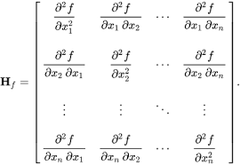

# GROMACS Hessian frequency

## Necessary files
```
----FORCEFILED
|   ----molecule.ff
|       ----forcefield.itp
|       ----*.rtp
|   ----molecule.top
|
----QM_GAS_PHASE
|   ----molecule.fchk
|
----STRUCTURE
|   ----molecule.pdb
```
## Example
* BEN


some source code: https://github.com/selimsami/qforce