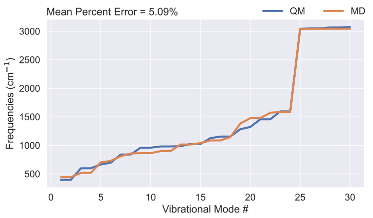

# GROMACS Hessian frequency
## Introduction
A tool for calculating molecule vibrational mode and its corresponding frequency using GROMACS input 
and compare the results with QM calculation.

## Necessary files
```
----FORCEFILED
|   ----molecule.ff
|       ----forcefield.itp
|       ----*.rtp
|   ----molecule.top
|
----QM_GAS_PHASE
|   ----molecule.fchk
|
----STRUCTURE
|   ----molecule.pdb
```
## Example
* BEN
```{python}
compound = 'BEN'
mypath = './'
vib_scaling = 0.957
include_nonbonded = False
have_dihedral = False
```




some source code: https://github.com/selimsami/qforce