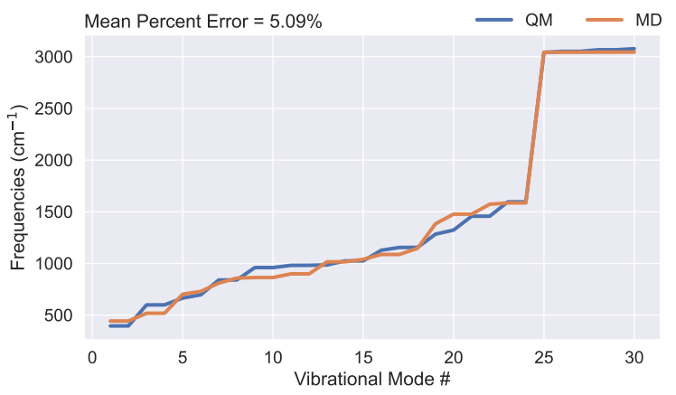

# GROMACS Hessian frequency
## Introduction

<div align="center">
A tool for calculating molecular vibrational modes and corresponding frequencies using GROMACS input, and comparing the results with quantum mechanical (QM) calculations.
</div>

## Usage
```bash
python calc_frequency.py
```
### Input Setting (In calc_frequency.py)
```python
compound = 'BEN'
mypath = './'
vib_scaling = 0.957 
include_nonbonded = False 
include_dihedral = False
```
* **compound**: Molecule name
* **mypath**: The path can find the directory of molecule
* **vib_scaling**: The scaling value of vibrational frequecy, 0.957 is used for wb97XD/6-311++G(d,p). Other scaling value can be found on https://cccbdb.nist.gov/vibscalejustx.asp
* **include_nonbonded**: True: Include nonbonded interaction in calculation
* **include_dihedral**: True: Include diheral term in calculation

## Requirement
### Python Package
* numpy
* ase
* seaborn
### Necessary files
```
----FORCEFILED
|   ----molecule.ff
|       ----forcefield.itp
|       ----*.rtp
|   ----molecule.top
|
----QM_GAS_PHASE
|   ----molecule.fchk
|
----STRUCTURE
|   ----molecule.pdb
```

## Example
### BEN (benzene)  
#### Input setting
```python
compound = 'BEN' # Molecule
mypath = './' # The path can find the directory of molecule

# The scaling value of vibrational frequecy, 0.957 is used for wb97XD/6-311++G(d,p) 
# Other scaling value can be found on https://cccbdb.nist.gov/vibscalejustx.asp
vib_scaling = 0.957 

include_nonbonded = False # True: Include nonbonded interaction in calculation
include_dihedral = False # True: Include diheral term in calculation
```
#### Results



some source code: https://github.com/selimsami/qforce